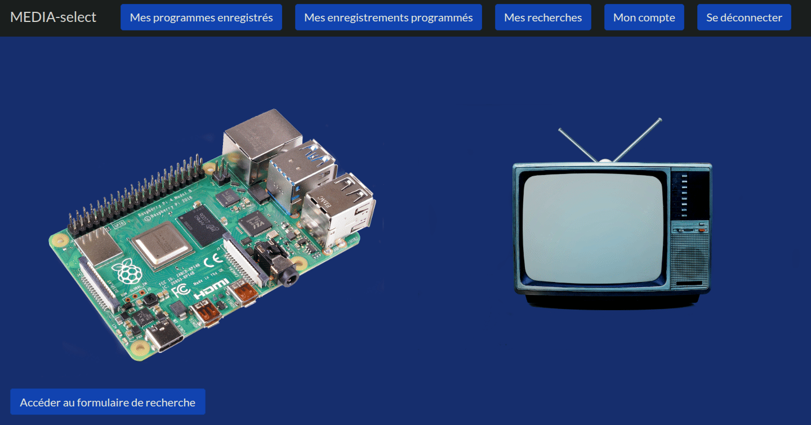

# 📺 mediaselect-fr v3.1.0

> 🏠 Turn your local network TV into an automated recording engine
> 📼 Automatically record TV programs from RTSP streams (Freebox)

---

---

## 🍿 How TV Select works

TV Select turns TV into a **personal discovery engine**.

You define what you care about:

* a documentary about wine 🍷
* a history episode 🏛️
* a space report 🚀
* that rare movie you couldn’t find anywhere 🎬
* a tennis documentary your son will love 🎾

Then the system works for you:

1. 🔍 Your searches are analyzed
2. 🧠 TV programs are continuously scanned
3. 🎯 When a match is found:

   * 📧 You receive a notification
   * 📼 A recording is triggered automatically

👉 No manual searching. No scheduling.

---

## 📖 TV Select Ecosystem

This project is part of the **TV Select ecosystem**.

👉 Overview & setup guide:

## 🏠 About mediaselect-fr

mediaselect-fr records TV programs from **RTSP streams available on your local network**.

👉 Typically used with:

- Freebox (Multiposte / RTSP streams)
- Local network TV sources

---

## ⚡ Key features

- 📡 Record from RTSP streams (Freebox)
- 🏠 Fully local network recording
- 📼 Continuous automated recording
- ⚙️ Fully automated via cron jobs

---

## 🧩 How it works

Search → Match → RTSP Stream → Record → Watch

---

## 📡 RTSP (Freebox) specifics

Freebox devices can act as an IPTV provider on your local network using **RTSP streams**.

- No external IPTV provider required
- Streams are available locally via your network
- Recording happens on your device (SBC or VM)

⚠️ Limitations:

- Channel list is restricted (e.g. TF1, M6 unavailable)
- Depends on your local network stability
- Storage capacity must be considered (SD card / disk)

---

## 📁 Output

Videos are stored in:

~/videos_select

Format:

title + video_id + search + source.ts

---

## ⚡ Installation

### Requirements

- Linux (Raspberry Pi, VM, server)
- Python 3
- Freebox (or RTSP source on local network)
- Account on https://www.media-select.fr

---

### Install dependencies

sudo apt update && sudo apt install at curl vlc mplayer streamlink virtualenv ffmpeg unzip jq

---

### Download

cd ~
curl -L -o mediaselect-fr.zip https://github.com/mediaselect/mediaselect-fr/archive/refs/tags/v2.0.0.zip
unzip mediaselect-fr.zip
mv mediaselect-fr-2.0.0 mediaselect-fr

---

### Setup

mkdir -p ~/.local/share/mediaselect-fr ~/.config/mediaselect-fr

cd ~/.local/share/mediaselect-fr
virtualenv -p python3 .venv
source .venv/bin/activate
pip install -r ~/mediaselect-fr/requirements.txt

---

### Install and start

cd ~/mediaselect-fr
source ~/.local/share/mediaselect-fr/.venv/bin/activate
python3 install.py

---

## ⚙️ Configuration

Set Freebox as RTSP source:

cd ~/mediaselect-fr
cp free_conf.ini ~/.config/mediaselect-fr/iptv_select_conf.ini

---

## ⏳ What to expect

- ❌ No immediate results
- ⏳ Wait for matches
- ✅ Videos are recorded automatically

---

## 🤔 When should you use mediaselect-fr?

Use this version if:

- you have a Freebox
- you want a local network-based setup (no external IPTV provider required)
- you don’t want IPTV subscriptions
- you are okay with a limited channel list

---

## ⚠️ Limitations

- Limited channel availability (RTSP scope)
- RTSP streams may occasionally be unstable (interruptions or drops)
- Storage required for recordings

---

## ⭐ Support

If you like this project:

- ⭐ Star it
- 🔁 Share it
- 🧠 Use it

---

## ⚠️ Disclaimer

For personal use only.
